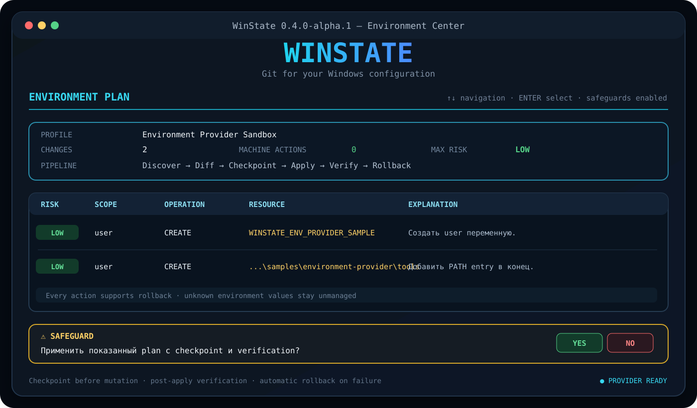

<p align="center">
  
</p>

<p align="center">
  <strong>Интерактивная консольная утилита для безопасного декларативного управления Windows.</strong>
</p>

<p align="center">
  <a href="docs/TERMINAL_UI.md">🖥️ Control Center</a> ·
  <a href="docs/PROFILE_ENGINE.md">🧩 Profile Engine</a> ·
  <a href="docs/ENVIRONMENT_PROVIDER.md">🌿 Environment Provider</a> ·
  <a href="docs/SECURITY.md">🛡️ Безопасность</a> ·
  <a href="docs/IMPLEMENTATION_PLAN.md">🗺️ Roadmap</a>
</p>

---

## ✨ WinState `0.4.0-alpha.1`

WinState получил первый настоящий Windows provider. Теперь Control Center умеет не только читать профиль, но и безопасно управлять пользовательскими и машинными переменными окружения и отдельными элементами `PATH`.

```text
Discover → Diff → Plan → Confirm
         → Checkpoint → Apply → Verify → Rollback
```

Каждое изменение сначала появляется в execution plan. До применения создаётся checkpoint. После применения WinState повторно читает систему и проверяет результат. Ошибка включает автоматический rollback.

## 🌿 Превью Environment Center

<p align="center">
  
</p>

> Превью схематически показывает интерфейс. Реальный вид зависит от шрифта, размера окна и поддержки ANSI-цветов.

## 🖥️ Запуск

Требуется **.NET 8 SDK**.

```powershell
git clone https://github.com/Onmaynec/WinState.git
cd WinState

dotnet restore
dotnet build -c Release
dotnet test -c Release

dotnet run --project src/WinState.Cli
```

Без аргументов открывается полноэкранный **WinState Control Center** с большим символьным логотипом, стрелочным меню, отдельными страницами и анимациями операций.

| Клавиша | Действие |
|---|---|
| `↑` / `↓` | перемещение по меню |
| `Enter` | открыть раздел |
| `Y/N` | подтвердить или отменить системную операцию |
| `Ctrl+C` | безопасно отменить текущий сценарий |

## 🧭 Разделы Control Center

- **Обзор системы** — платформа, SQLite, профили и готовность providers;
- **Центр профилей** — загрузка и проверка YAML;
- **Environment Center** — plan, apply, status и rollback;
- **Диагностика** — Doctor с цветными статусами;
- **Хранилище** — миграции, таблицы и размер базы;
- **Конфигурация** — вычисленные каталоги и параметры;
- **Архитектура и roadmap** — карта модулей и следующий этап.

## 🛡️ Безопасный Environment Provider

### Что поддерживается

- User environment variables;
- Machine environment variables;
- User `PATH` entries;
- Machine `PATH` entries;
- создание и изменение переменных;
- добавление, удаление и перестановка конкретных PATH entries;
- checkpoint, verification и rollback;
- SQLite transaction history.

Неописанные переменные и неизвестные элементы PATH не удаляются.

### User scope

```yaml
environment:
  user:
    DEV_MODE: "true"

  userPath:
    - path: "C:\\Dev\\bin"
      state: present
      position: append
```

User actions имеют risk level `Low`, но всё равно требуют явного подтверждения.

### Machine scope

```yaml
environment:
  machine:
    COMPANY_MODE: "managed"
```

Machine actions имеют risk level `Medium`, помечаются `RequiresAdministrator` и требуют отдельного подтверждения. CLI требует `--allow-machine`, а терминал должен быть запущен от имени администратора.

## 🚀 CLI-сценарий

Проверить provider:

```powershell
winstate environment status
```

Построить план без изменений:

```powershell
winstate environment plan `
  .\samples\environment-provider\user-sandbox.yaml
```

Применить после просмотра:

```powershell
winstate environment apply `
  .\samples\environment-provider\user-sandbox.yaml `
  --yes
```

Посмотреть checkpoint:

```powershell
winstate environment checkpoints
```

Откатить транзакцию:

```powershell
winstate environment rollback `
  .\.winstate\backups\environment\<transaction>\manifest.json `
  --yes
```

Сокращение `env` работает так же, как `environment`.

## 💾 Checkpoint и история

Перед первым изменением WinState создаёт каталог:

```text
<WINSTATE_HOME>/backups/environment/<transaction-id>/
├── manifest.json
├── env-create-....json
├── env-modify-....json
└── env-remove-....json
```

Для переменной сохраняются старое значение и факт её существования. Для PATH сохраняется полный список entries соответствующего scope.

SQLite хранит:

- `Transactions` — итог сценария;
- `TransactionActions` — результат каждого действия;
- `ActionBackups` — ссылки на checkpoint.

## 🧩 Profile Engine

Полный YAML Profile Engine из версии `0.3` остаётся основой provider-сценариев:

- `includes` и `extends`;
- защита от циклов;
- `{{name}}` и `${name}`;
- `WINSTATE_VAR_*`;
- `--var name=value`;
- объединение profile layers;
- нормализация и дедупликация PATH.

```powershell
winstate validate .\samples\profile-engine\workstation.yaml `
  --var developerName=Roman `
  --var mode=true
```

## ✅ Текущее состояние

| Возможность | Статус |
|---|---|
| Интерактивный Control Center | ✅ |
| Стрелочное управление, панели и анимации | ✅ |
| Полный YAML Profile Engine | ✅ |
| Environment discovery и diff | ✅ |
| Risk-aware execution plan | ✅ |
| User/Machine variables | ✅ |
| PATH add/remove/reorder | ✅ |
| Checkpoint перед apply | ✅ |
| Post-apply verification | ✅ |
| Автоматический и ручной rollback | ✅ |
| SQLite transaction history | ✅ |
| Linux + Windows CI | ✅ |
| Общий cross-provider Apply Engine | ⏭️ следующий этап |

## 🧪 Проверки

GitHub Actions выполняет на Ubuntu и Windows:

```text
restore → build with warnings-as-errors → unit tests
        → Profile Engine → terminal render → Doctor → SQLite
```

На Windows дополнительно выполняется настоящий временный User-scope сценарий:

```text
environment plan
→ apply
→ checkpoint
→ verification
→ rollback
→ assert variable and PATH restored
```

Unit-тесты Environment Provider используют in-memory store и покрывают diff, no-op, risk, apply, verify и rollback без изменения машины разработчика.

## 🧱 Архитектура

```text
WinState.Terminal
        ↓
WinState.App workflows
        ↓
WinState.Core ───────────── Profile Engine / validation / planning
        ├── WinState.Providers.Environment
        ├── WinState.Infrastructure
        ├── WinState.Storage ───────── SQLite history / migrations
        └── WinState.Domain ────────── resources / actions / providers
```

UI не содержит системной бизнес-логики: CLI и Control Center вызывают один `EnvironmentWorkflow`.

## ⚠️ Ограничения alpha-версии

- системный apply доступен только для environment-секции;
- нет secrets adapter;
- нет удаления обычной переменной через profile state;
- нет общего resume/reboot engine;
- Machine scope зависит от реальных прав процесса;
- WinState не заменяет полный backup Windows.

## 🗺️ Следующий этап

`0.5.0-alpha.1` — общий **Apply Engine**:

```text
multiple providers → unified transaction → risk groups
                   → dependency execution → resume/reboot → rollback
```

Подробнее: [`docs/IMPLEMENTATION_PLAN.md`](docs/IMPLEMENTATION_PLAN.md).

## 📦 Portable ZIP

```powershell
.\scripts\package.ps1
```

Архив и SHA-256 создаются в `artifacts/`.

## 📄 Лицензия

MIT License — см. [`LICENSE`](LICENSE).
