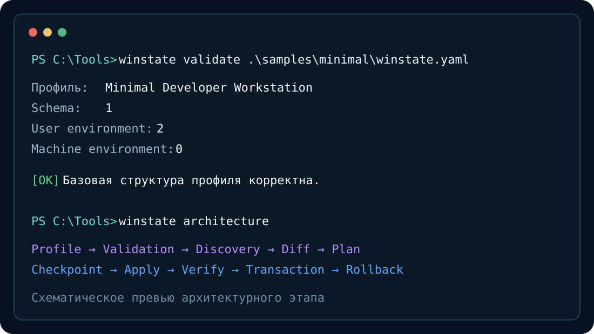
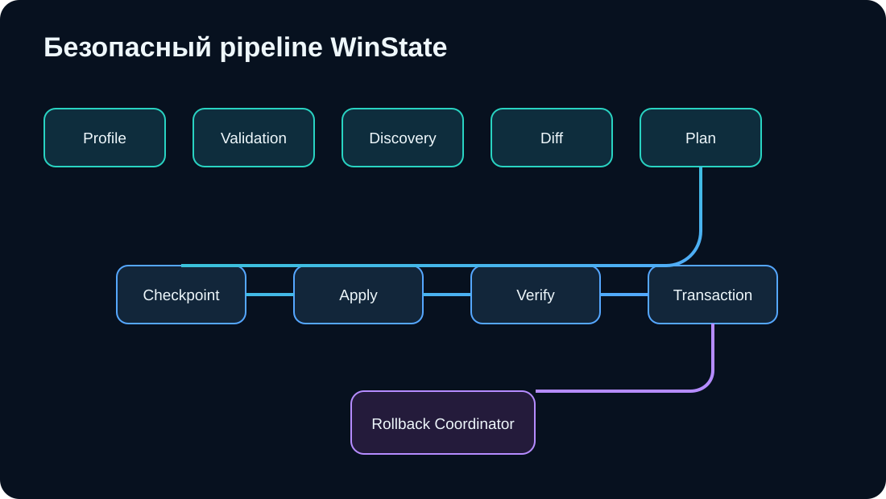

<p align="center">
  
</p>

<p align="center">
  <strong>Сохраняйте конфигурацию Windows как код, заранее проверяйте изменения и проектируйте безопасный rollback.</strong>
</p>

<p align="center">
  <a href="docs/ARCHITECTURE.md">🏗️ Архитектура</a> ·
  <a href="docs/PROFILE_FORMAT.md">📝 Формат профиля</a> ·
  <a href="docs/PROVIDERS.md">🔌 Провайдеры</a> ·
  <a href="docs/SECURITY.md">🛡️ Безопасность</a> ·
  <a href="docs/IMPLEMENTATION_PLAN.md">🗺️ План</a>
</p>

---

## ✨ Что такое WinState?

**WinState** — open-source CLI-инструмент для Windows 10/11, который должен уметь сохранять конфигурацию компьютера в декларативный профиль, находить расхождения, строить понятный execution plan, безопасно применять изменения, проверять результат и откатывать обратимые действия.

```text
Capture → Compare → Plan → Apply → Verify → Rollback
```

> **Текущий статус:** опубликован первый архитектурный этап `0.1.0-alpha.1`. Системные настройки Windows пока не изменяются. Репозиторий содержит проверяемое ядро, на котором будет построен первый полный vertical slice.

## 🖥️ Превью CLI

<p align="center">
  
</p>

## 🏗️ Превью архитектуры

<p align="center">
  
</p>

> Изображения выше — аккуратные **схематические превью текущего этапа**, а не скриншоты готового apply-engine.

## ✅ Что уже реализовано

| Область | Состояние |
|---|---|
| Доменная модель ресурсов и действий | ✅ |
| Риски, зависимости и capabilities | ✅ |
| Контракты provider / rollback | ✅ |
| Модель профиля и JSON Schema | ✅ |
| Bootstrap YAML reader | ✅ |
| Базовая валидация профиля | ✅ |
| Детерминированный dependency graph | ✅ |
| Модель транзакций | ✅ |
| CLI `help`, `version`, `architecture`, `validate` | ✅ |
| Unit-тесты и GitHub Actions | ✅ |
| Реальное изменение Windows | 🧭 следующий этап |

## 🚀 Быстрый старт для разработчика

Требуется **.NET 8 SDK**.

```powershell
git clone https://github.com/Onmaynec/WinState.git
cd WinState

dotnet restore
dotnet build
dotnet test
dotnet run --project src/WinState.Cli -- --help
```

Проверка примера профиля:

```powershell
dotnet run --project src/WinState.Cli -- validate .\samples\minimal\winstate.yaml
```

## 📝 Минимальный профиль

```yaml
schemaVersion: 1

metadata:
  name: Developer Workstation
  description: Рабочая среда разработчика

environment:
  user:
    DEV_MODE: "true"
    WINSTATE_TEST: "enabled"
```

Полное описание: [`docs/PROFILE_FORMAT.md`](docs/PROFILE_FORMAT.md).

## 🧱 Структура репозитория

```text
WinState/
├── .github/workflows/       # build и release
├── assets/                  # баннер и превью
├── docs/                    # русская документация
├── schemas/                 # JSON Schema профиля
├── samples/                 # безопасные примеры
├── scripts/                 # build/test/package
├── src/
│   ├── WinState.Domain/     # чистая доменная модель
│   ├── WinState.Core/       # profile/planning primitives
│   └── WinState.Cli/        # CLI и exit codes
└── tests/WinState.Core.Tests/
```

## 🔐 Безопасность прежде всего

WinState проектируется так, чтобы:

- всегда показывать план до изменения системы;
- не удалять неизвестные ресурсы;
- не хранить секреты в профилях, логах и транзакциях;
- запрашивать elevation только при необходимости;
- не считать успешный exit code достаточной проверкой;
- честно показывать покрытие rollback;
- не перезагружать компьютер без явного разрешения.

Подробнее: [`docs/SECURITY.md`](docs/SECURITY.md).

## 🗺️ Ближайший этап

Следующая цель — **Environment Provider vertical slice**:

```text
Discover → Diff → Plan → Apply → Verify → Checkpoint → Rollback
```

Он станет первым полностью рабочим сценарием и задаст эталон для остальных провайдеров.

## ⚠️ Ограничения текущей версии

- bootstrap-reader поддерживает только базовый YAML-поднабор;
- includes, extends, variables и conditions ещё не реализованы;
- SQLite и системные провайдеры ещё не подключены;
- CLI пока не выполняет `capture`, `plan`, `apply` и `rollback`;
- WinState не является полноценным backup-решением.

## 📦 Сборка ZIP

```powershell
.\scripts\package.ps1
```

Архив и SHA-256 появятся в `artifacts/`.

## 🤝 Участие в разработке

Перед изменениями прочитайте [`CONTRIBUTING.md`](CONTRIBUTING.md). Особое внимание уделяется безопасности, идемпотентности, тестируемости и честной документации незавершённых функций.

## 📄 Лицензия

MIT — см. [`LICENSE`](LICENSE).
