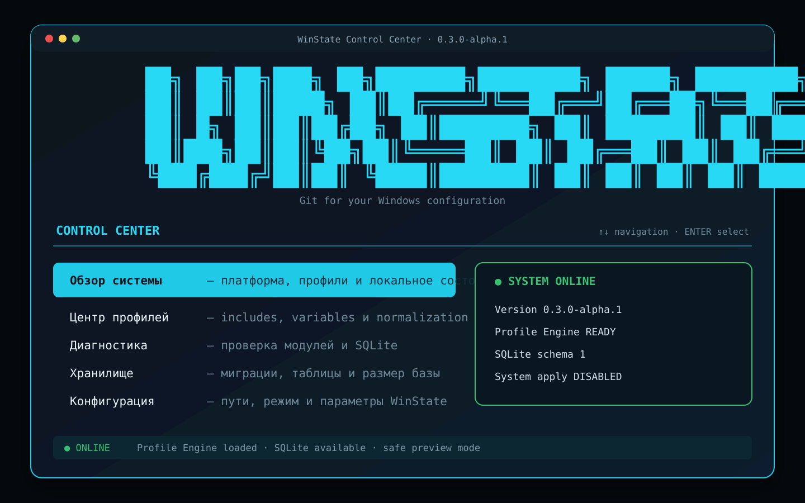

<p align="center">
  
</p>

<p align="center">
  <strong>Интерактивная консольная утилита для декларативного управления состоянием Windows.</strong>
</p>

<p align="center">
  <a href="docs/TERMINAL_UI.md">🖥️ Control Center</a> ·
  <a href="docs/PROFILE_ENGINE.md">🧩 Profile Engine</a> ·
  <a href="docs/ARCHITECTURE.md">🏗️ Архитектура</a> ·
  <a href="docs/SECURITY.md">🛡️ Безопасность</a> ·
  <a href="docs/IMPLEMENTATION_PLAN.md">🗺️ Roadmap</a>
</p>

---

## ✨ WinState 0.3

**WinState** больше не выглядит как обычный набор команд для CMD. При запуске без аргументов открывается собственный полноэкранный **Control Center** с крупным символьным логотипом, панелями, стрелочным управлением и анимациями операций.

```powershell
# Интерактивный режим
winstate

# Во время разработки
dotnet run --project src/WinState.Cli
```

CLI-команды сохранены для CI, скриптов и автоматизации:

```powershell
winstate doctor
winstate validate .\profiles\workstation.yaml --var developerName=Roman
winstate storage status
```

## 🖥️ Превью Control Center

<p align="center">
  
</p>

> Превью схематически показывает интерфейс терминала. Реальный вид зависит от шрифта, размера окна и поддержки ANSI-цветов.

## 🎛️ Управление

| Клавиша | Действие |
|---|---|
| `↑` / `↓` | перемещение по меню |
| `Enter` | открыть выбранный раздел |
| любая клавиша | вернуться в Control Center |
| `Ctrl+C` | безопасно отменить текущую операцию |

Разделы панели:

- **Обзор системы** — версия, платформа, режим, профили и SQLite;
- **Центр профилей** — поиск и проверка YAML-файлов;
- **Диагностика** — оформленный Doctor с анимацией;
- **Хранилище** — миграции, таблицы и размер базы;
- **Конфигурация** — вычисленные пути и режим запуска;
- **Архитектура и roadmap** — карта модулей и следующий этап.

## 🧩 Полный Profile Engine

Версия `0.3.0-alpha.1` заменяет bootstrap-reader полноценным загрузчиком YAML:

- `includes` и `extends`;
- обнаружение циклов наследования;
- переменные `{{name}}` и `${name}`;
- значения `WINSTATE_VAR_*`;
- CLI-переопределения `--var name=value`;
- объединение environment-секций;
- нормализация и дедупликация PATH;
- список всех исходных файлов профиля;
- подробная валидация результата.

Пример:

```yaml
schemaVersion: 1

extends:
  - base.yaml

metadata:
  name: "{{developerName}} Workstation"

variables:
  developerName: Developer

environment:
  user:
    DEV_MODE: "${mode}"
```

```powershell
winstate validate .\samples\profile-engine\workstation.yaml `
  --var developerName=Roman `
  --var mode=true
```

Подробнее: [`docs/PROFILE_ENGINE.md`](docs/PROFILE_ENGINE.md).

## ✅ Что уже работает

| Возможность | Статус |
|---|---|
| Интерактивная панель со стрелками | ✅ |
| Большой символьный логотип и отдельные экраны | ✅ |
| Анимации загрузки и операций | ✅ |
| CLI-режим для автоматизации | ✅ |
| Profile Engine: includes / extends | ✅ |
| Variables и normalization | ✅ |
| Dependency injection и logging | ✅ |
| SQLite и миграции | ✅ |
| Doctor / config / storage | ✅ |
| Linux + Windows CI | ✅ |
| Изменение системных настроек Windows | ⏭️ следующий vertical slice |

## 🚀 Быстрый старт

Требуется **.NET 8 SDK**.

```powershell
git clone https://github.com/Onmaynec/WinState.git
cd WinState

dotnet restore
dotnet build -c Release
dotnet test -c Release

dotnet run --project src/WinState.Cli
```

Для отдельного рабочего каталога:

```powershell
dotnet run --project src/WinState.Cli -- --home .\.winstate-dev
```

## 🧱 Архитектура

```text
WinState.Terminal  → панели, меню, анимации
        ↓
WinState.App       → DI и прикладные сценарии
        ↓
WinState.Core      → Profile Engine и planning
        ├── WinState.Infrastructure → config и platform paths
        ├── WinState.Storage        → SQLite и migrations
        └── WinState.Domain         → модели и provider contracts
```

Интерактивный UI не содержит бизнес-логики: все операции выполняются через `WinStateApplication`.

## 🛡️ Безопасность

Текущая версия **не изменяет настройки Windows**. Перед первым системным провайдером будут обязательны execution plan, оценка риска, checkpoint, verification и rollback. WinState не хранит секреты в профилях, логах или SQLite и не заменяет полноценный backup.

## 🗺️ Следующий этап

Первый полный vertical slice — **Environment Provider**:

```text
Discover → Diff → Plan → Confirm → Apply → Verify → Rollback
```

Он добавит реальное управление пользовательскими и системными переменными окружения, включая PATH, но только после безопасного плана и резервирования предыдущего состояния.

## 📦 Сборка portable ZIP

```powershell
.\scripts\package.ps1
```

Архив и SHA-256 появятся в `artifacts/`.

## 📄 Лицензия

MIT License — см. [`LICENSE`](LICENSE).
