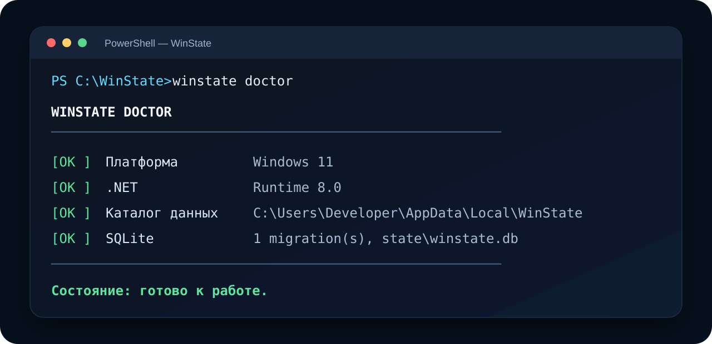

<p align="center">
  
</p>

<p align="center">
  <strong>Сохраняйте конфигурацию Windows как код, заранее проверяйте изменения и проектируйте безопасный rollback.</strong>
</p>

<p align="center">
  <a href="docs/ARCHITECTURE.md">🏗️ Архитектура</a> ·
  <a href="docs/CONFIGURATION.md">⚙️ Конфигурация</a> ·
  <a href="docs/STORAGE.md">🗄️ SQLite</a> ·
  <a href="docs/IMPLEMENTATION_PLAN.md">🗺️ Roadmap</a>
</p>

---

## ✨ Что такое WinState?

**WinState** — open-source CLI-инструмент для Windows 10/11, который постепенно строится вокруг безопасного жизненного цикла:

```text
Capture → Compare → Plan → Apply → Verify → Rollback
```

> **Текущий статус:** `0.2.0-alpha.1`. Реализован рабочий application skeleton: DI, logging, конфигурация, portable paths, SQLite и миграции. Системные настройки Windows пока не изменяются.

## 🩺 Превью WinState Doctor

<p align="center">
  
</p>

## ✅ Что уже работает

| Область | Состояние |
|---|---|
| Доменная модель и provider contracts | ✅ |
| Bootstrap YAML validation | ✅ |
| Dependency graph | ✅ |
| Dependency injection | ✅ |
| Console logging | ✅ |
| `winstate.json` и `WINSTATE_*` | ✅ |
| User-data / portable paths | ✅ |
| SQLite + migration history | ✅ |
| `doctor`, `config`, `storage` | ✅ |
| Unit tests и Linux/Windows CI | ✅ |
| Полный Profile Engine | ⏭️ следующий этап |
| Изменение Windows | 🧭 после Profile Engine |

## 🚀 Быстрый старт

```powershell
git clone https://github.com/Onmaynec/WinState.git
cd WinState

dotnet restore
dotnet build -c Release
dotnet test -c Release

dotnet run --project src/WinState.Cli -- --help
dotnet run --project src/WinState.Cli -- doctor --home .\.winstate-dev
dotnet run --project src/WinState.Cli -- storage status --home .\.winstate-dev
```

## ⚙️ Конфигурация

```powershell
winstate config show
winstate config path
```

Поддерживаются `WINSTATE_HOME`, `WINSTATE_PROFILES`, `WINSTATE_DATABASE`, `WINSTATE_LOGS`, `WINSTATE_LOG_LEVEL` и `WINSTATE_PORTABLE`.

## 🗄️ SQLite

```powershell
winstate storage migrate
winstate storage status
```

Миграции транзакционны и идемпотентны. Начальная схема готовит таблицы для профилей, ownership, baseline, транзакций, backup metadata и drift.

## 🛡️ Безопасность

WinState не хранит секреты в конфигурации или SQLite, не применяет системные изменения вслепую и не обещает полный backup Windows. Опасные provider-функции появятся только вместе с планом, подтверждением, checkpoint, verification и rollback.

## 🗺️ Следующий этап

`0.3.0-alpha.1` — полный Profile Engine: YAML loading, includes, inheritance, variables и normalization.

## 📄 Лицензия

MIT License.
