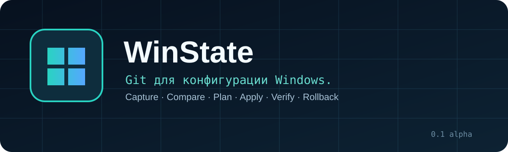
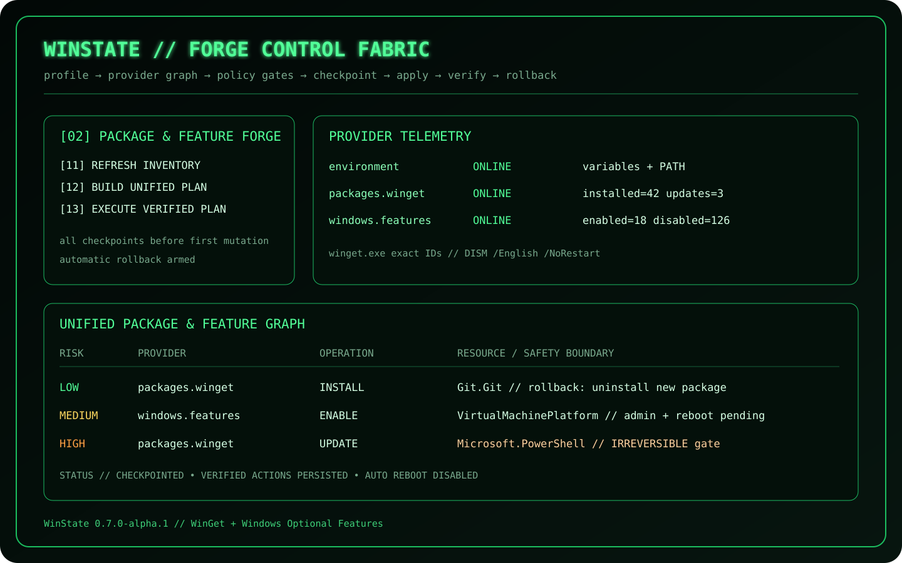

<p align="center">
  
</p>

# 🇷🇺 WinState

Русская документация является основной документацией проекта. Полное описание находится в [`README.md`](README.md).

## Текущая версия

**`0.7.0-alpha.1` — Package & Feature Forge, WinGet Provider и Windows Optional Features.**

```text
Environment + WinGet + DISM Features
→ unified execution graph
→ policy gates → checkpoints → apply → verify
→ resume / reboot pending / cross-provider rollback
```

<p align="center">
  
</p>

## Быстрый старт

```powershell
git clone https://github.com/Onmaynec/WinState.git
cd WinState

dotnet restore
dotnet build -c Release
dotnet test -c Release
dotnet run --project src/WinState.Cli
```

## Что добавлено

- секция YAML `packages`;
- секция YAML `features`;
- WinGet install, upgrade, uninstall и verification;
- DISM inventory, enable, disable и rollback;
- честные irreversible boundaries для package upgrade/uninstall;
- общий transaction graph для трёх production providers;
- Package & Feature Forge с telemetry, risk plan и execution trace;
- тесты через fake clients без изменения Windows;
- Windows CI prerequisite scan.

## Документация

- [`docs/PACKAGES_FEATURES.md`](docs/PACKAGES_FEATURES.md) — WinGet и Optional Features;
- [`docs/APPLY_ENGINE.md`](docs/APPLY_ENGINE.md) — общий transaction engine;
- [`docs/AUTO_UPDATE.md`](docs/AUTO_UPDATE.md) — проверка и установка обновлений;
- [`docs/PROFILE_ENGINE.md`](docs/PROFILE_ENGINE.md) — YAML Profile Engine;
- [`docs/ENVIRONMENT_PROVIDER.md`](docs/ENVIRONMENT_PROVIDER.md) — Environment Provider;
- [`docs/SECURITY.md`](docs/SECURITY.md) — safeguards и rollback boundaries;
- [`docs/IMPLEMENTATION_PLAN.md`](docs/IMPLEMENTATION_PLAN.md) — roadmap.

## Безопасность package/feature операций

- новая WinGet-установка может быть удалена при rollback;
- upgrade и uninstall требуют отдельного irreversible confirmation;
- Optional Features всегда требуют administrator policy;
- DISM запускается с `/NoRestart`;
- success фиксируется только после verification;
- WinState не выполняет скрытую перезагрузку.

## Лицензия

MIT License — см. [`LICENSE`](LICENSE).
