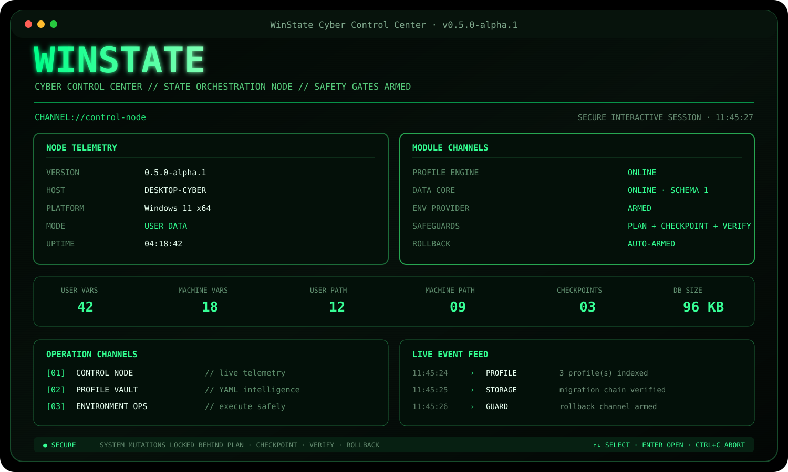

# 🟢 Cyber Control Center

`WinState 0.5.0-alpha.1` полностью меняет визуальный язык интерактивного режима. Новый frontend построен как плотный terminal control node: зелёная cyber-палитра, номерные каналы операций, boot trace, живые события и анимированные конвейеры действий.

<p align="center">
  
</p>

> Интерфейс вдохновлён общей эстетикой NexRoute: техническая плотность, operation channels, живые статусы и ощущение отдельной Windows-утилиты. WinState при этом сохраняет собственную safety-first архитектуру.

## 🚀 Запуск

```powershell
dotnet run --project src/WinState.Cli
```

При старте отображается последовательность загрузки:

```text
KERNEL     loading domain contracts                         OK
PROFILE    mounting YAML profile engine                     OK
STORAGE    opening local state channel                      OK
PROVIDER   binding Windows environment provider             OK
SAFEGUARD  arming plan/checkpoint/verify/rollback gates     ARMED
```

Анимация показывает настоящие стадии запуска. SQLite и provider workflow по-прежнему выполняются через `WinStateApplication`, а не внутри terminal frontend.

## 🧭 Operation channels

| Канал | Экран | Назначение |
|---|---|---|
| `[01]` | Control Node | телеметрия платформы, модулей, переменных, PATH и checkpoint |
| `[02]` | Profile Vault | поиск, выбор и статический анализ YAML-профилей |
| `[03]` | Environment Ops | plan, apply, verification и rollback |
| `[04]` | Checkpoint Vault | просмотр и восстановление manifest-файлов |
| `[05]` | Deep Scan | анимированная диагностика Doctor |
| `[06]` | Data Core | SQLite schema, migration chain и таблицы |
| `[07]` | Node Config | вычисленные каталоги и runtime settings |
| `[08]` | System Map | архитектура, safeguards и roadmap |
| `[00]` | Disconnect | анимированное завершение сессии |

## 🎞️ Анимации действий

Cyber Control Center использует progress pipeline из трёх фаз:

```text
handshake → operation → seal result
```

Он применяется к:

- инициализации SQLite;
- анализу профиля;
- discovery и environment diff;
- checkpoint/apply/verify transaction;
- rollback;
- Doctor scan;
- проверке migration chain.

После системной транзакции выводится поток действий:

```text
11:45:27.132 PASS          env-create-1a2b3c // Переменная подтверждена.
11:45:27.208 PASS          env-create-4d5e6f // PATH entry подтверждён.
```

Статус берётся из реального `EnvironmentExecutionReport`. UI не подменяет результат анимацией и не показывает успех до завершения verification.

## 📡 Live telemetry

Главный экран показывает:

- версию и host;
- Windows/архитектуру процесса;
- режим portable/user-data;
- uptime;
- состояние Profile Engine, Data Core и Environment Provider;
- количество User/Machine variables;
- количество PATH entries;
- число rollback checkpoint;
- размер SQLite;
- live event feed.

## 🗃️ Profile Vault

В версии `0.5` интерфейс индексирует не только пользовательский `ProfilesDirectory`, но и YAML-файлы из repository-каталога `samples`. Поэтому примеры сразу доступны в интерактивном меню при запуске из корня репозитория.

Каждый профиль проходит:

```text
parse → includes/extends → variables → normalization → validation
```

## 🛡️ Safeguards не изменены

Новый дизайн не добавляет альтернативный путь к системным операциям.

- apply выполняется только через `EnvironmentWorkflow`;
- сначала строится новый план;
- default confirmation — `No`;
- Machine scope получает отдельное красное подтверждение;
- checkpoint всех действий создаётся до первой мутации;
- verification выполняется повторным чтением Windows;
- automatic rollback остаётся включённым;
- unmanaged resources не удаляются.

## 🤖 CI mode

```powershell
winstate ui --demo --home .\.ci-winstate
```

Demo mode:

- не ждёт клавиатуру;
- не выполняет системный apply;
- отключает искусственные задержки;
- рендерит полноценный Control Node snapshot;
- используется в Ubuntu и Windows GitHub Actions.

## 🧱 Реализация

Новый frontend находится в:

```text
src/WinState.Terminal/CyberTerminalShell.cs
```

CLI переключается на него через compile-time alias. Старый frontend остаётся в проекте как reference implementation и не содержит незакоммиченных изменений.

```text
CyberTerminalShell
       ↓
WinStateApplication
       ↓
Profile Engine / EnvironmentWorkflow / Storage / Doctor
```

Следующий этап — расширение transaction engine на несколько providers. Cyber Control Center станет frontend для общего execution graph, но системная логика останется вне UI.
