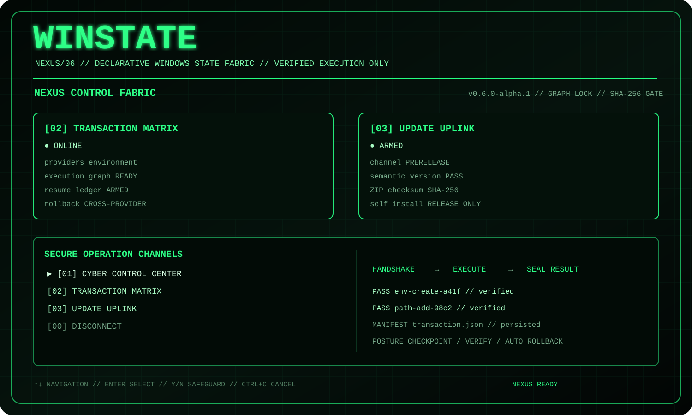

# 🟢 Cyber Nexus и Control Center

В `0.6.0-alpha.1` прежний `CyberTerminalShell` становится вложенным operation channel нового верхнего интерфейса `CyberNexusShell`.

<p align="center">
  
</p>

## Верхний уровень

```text
[01] CYBER CONTROL CENTER
[02] TRANSACTION MATRIX
[03] UPDATE UPLINK
[00] DISCONNECT
```

`[01]` открывает знакомый интерфейс версии `0.5`:

```text
Control Node
Profile Vault
Environment Ops
Checkpoint Vault
Deep Scan
Data Core
Node Config
System Map
```

Новые системные экраны вынесены наверх, чтобы общий transaction engine и updater не выглядели частью одного Environment Provider.

## Boot sequence

Nexus запускает progress trace:

```text
mount cyber terminal
load provider registry
restore transaction graph
arm rollback safeguards
establish update uplink
```

После boot инициализируется SQLite. Затем при необходимости выполняется ограниченная по интервалу проверка GitHub Releases.

## Transaction Matrix

Каналы:

| ID | Операция |
|---|---|
| `[11]` | Build Execution Graph |
| `[12]` | Execute Verified Graph |
| `[13]` | Resume Interrupted |
| `[14]` | Cross-provider Rollback |

Matrix показывает:

- зарегистрированные providers;
- число transaction manifests;
- resumable и reboot-pending counters;
- последние транзакции;
- provider IDs;
- ordered actions и dependencies;
- risk groups;
- admin, reboot и no-rollback flags;
- action-by-action trace.

## Update Uplink

Канал `[03]` показывает:

- repository;
- stable/prerelease channel;
- automatic update mode;
- runtime target;
- текущую версию;
- возможность self-install.

Проверка выполняется как анимированный pipeline:

```text
TLS handshake
→ GitHub Releases
→ Semantic Version comparison
→ ZIP + checksum download
→ SHA-256 gate
→ safe staging
```

Установка не запускается без policy режима `install` или подтверждения пользователя.

## Анимации

Общий визуальный язык:

```text
HANDSHAKE → EXECUTE → SEAL RESULT
```

Анимация оборачивает настоящий async workflow. UI не переводит операцию в success до возврата verified report.

## Цветовая схема

- зелёный — доступный канал, verified result, активная защита;
- жёлтый — Medium risk, reboot pending, rollback result;
- красный — ошибка, elevated/Critical/irreversible confirmation;
- серый — telemetry и source-mode ограничения.

## Safety boundary

`CyberNexusShell` отвечает только за:

- navigation;
- confirmations;
- animation;
- tables/panels;
- выбор manifest/profile;
- отображение результатов.

Он не:

- создаёт `PlannedAction`;
- изменяет Windows;
- пишет SQL;
- вычисляет checksum;
- распаковывает ZIP;
- выполняет rollback самостоятельно.

Системные вызовы направляются в:

```text
WinStateApplication
→ UnifiedApplyWorkflow / EnvironmentWorkflow
→ ApplyEngine / Provider
```

Обновления направляются в:

```text
UpdateService
```

## Demo mode

```powershell
winstate ui --demo --home .\.ci-winstate
```

Demo mode:

- не ждёт клавиатуру;
- не делает network request;
- не меняет Windows;
- не создаёт update process;
- выводит signatures `NEXUS CONTROL FABRIC`, `TRANSACTION MATRIX`, `UPDATE UPLINK`;
- используется в Ubuntu/Windows CI.

## Файлы реализации

```text
src/WinState.Terminal/CyberNexusShell.cs
src/WinState.Terminal/CyberTerminalShell.cs
src/WinState.Cli/CyberShellAlias.cs
```

Compile-time alias направляет CLI entry point на Nexus shell, а прежний Cyber Control Center вызывается как вложенный channel.
